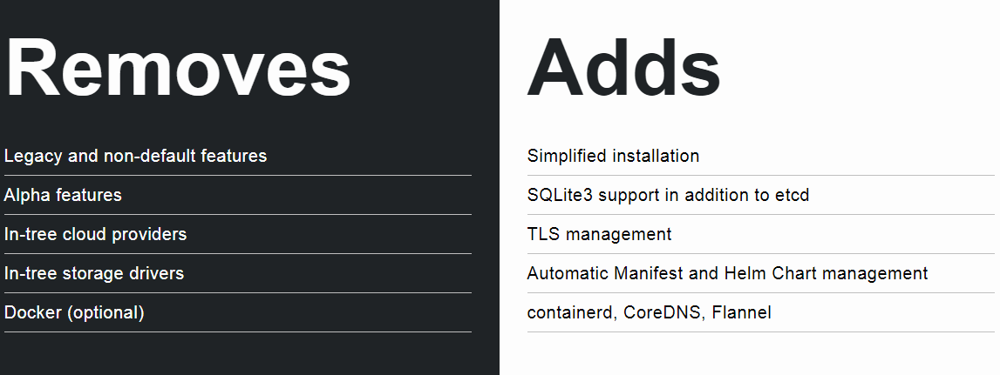

background-image: url(background.png)
background-size: cover
# Running k3s on Raspberry Pi

<br/>
<br/>
<br/>


.right-half[

<center></center>
]

---
exclude: true
### whoami

.left-small[
    
]

.right-large[
- Kyohei Mizumoto(@kyohmizu)

- C# Software Engineer

- Interests
    - Docker/Kubernetes
    - Go
    - Security
]

---
### Target

- People who:

  - haven't used k3s

  - haven't run k3s on Raspberry Pi

  - are interested in k3s cluster management

---
### Preferred Knowledge

- The basic knowledge of:

  - Docker

  - Kubernetes

  - Virtual Machine(Microsoft Azure)

---
### Agenda

- What is k3s?

- Get started

- Control Raspberry Pi using k3s

---
class: center, middle
# What is k3s?

---
class: center, middle
# kubernetes = k8s

---
class: center, middle
# k3s = k(8-5)s

---
class: header-margin
### k3s - 5 less than k8s

.left-large[
- Lightweight Kubernetes

  - Easy to install

  - Half the memory

  - Single binary less than 40MB
]

.right-small[<center></center>
]

---
class: header-margin
### k3s - 5 less than k8s

.left-large[
- Great for

  - Edge

  - IoT

  - CI

  - ARM
]

.right-small[<center></center>
]

---
### Changes

.zoom1[
<br/>
]

<center></center>

---
background-image: url(bg2.png)
background-size: cover
### How It Works

.zoom1[
<br/>
]

<center></center>

---
### k3s Pronounce "Kubes"...?

<u><https://github.com/rancher/k3s/issues/55></u>

<center></center>

---
class: center, middle
# Get started

---
### Download Binary

<u><https://github.com/rancher/k3s/releases/latest></u>

<center></center>

---
### Download Binary

.zoom2[
- DOWNLOADPATH:
https://github.com/rancher/k3s/releases/download/v0.5.0/k3s
]

```bash
$ wget [DOWNLOADPATH]
$ ls
k3s

$ chmod +x k3s
$ sudo mv k3s /usr/bin/
```

---
class: header-margin
### Run Server

.zoom2[
```bash
# Run in the background
$ sudo k3s server &
# Kubeconfig is written to /etc/rancher/k3s/k3s.yaml
$ k3s kubectl get node
NAME             STATUS     ROLES    AGE   VERSION
k3s-server       Ready      <none>   30s   v1.14.1-k3s.4

# Run without running the agent
$ k3s server --disable-agent
```
]

---
class: header-margin
### Join Nodes

.zoom2[
```bash
# NODE_TOKEN comes from
# /var/lib/rancher/k3s/server/node-token on the server
$ sudo k3s agent --server https://myserver:6443 \
  --token ${NODE_TOKEN}
```

- Show nodes on server:

```bash
$ k3s kubectl get node
NAME             STATUS     ROLES    AGE   VERSION
k3s-agent        Ready      <none>   1h    v1.14.1-k3s.4
k3s-server       Ready      <none>   1h    v1.14.1-k3s.4
```
]

---
class: center, middle
## Control Raspberry Pi using k3s

---
### Raspberry Pi

<u><https://www.raspberrypi.org/></u>

<center></center>

---
class: header-margin
### Configuration

<center></center>

---
class: header-margin
### Raspberry Pi Configuration

<center></center>

---
### Raspberry Pi Configuration

- Raspberry Pi 3 B+

- Breadboard

- LED

- Resistor

- Jump wire

---
### Required Preparation

- Create VM on Microsoft Azure

- Run k3s server on the VM (with a node)

- Join k3s node on Raspberry Pi

.zoom2[
```bash
$ k3s kubectl get node
NAME         STATUS   ROLES    AGE   VERSION
k3s-server   Ready    <none>   19d   v1.14.1-k3s.4
raspi-1      Ready    <none>   16d   v1.14.1-k3s.4
```
]

---
### Sample Program(sample.py)

```python
import RPi.GPIO as GPIO
import time

GPIO.setmode(GPIO.BCM) 
GPIO.setup(2,GPIO.OUT)

while True:
  GPIO.output(2,True)   
  time.sleep(1)
  GPIO.output(2,False)   
  time.sleep(1)

GPIO.cleanup()
```

---
### Dockerfile

```yaml
FROM python:3

ADD sample.py /

RUN pip install rpi.gpio

CMD [ "python", "./sample.py" ]
```

---
### Create Docker Image 

```bash
# [NAME] is an account name of Docker Hub
$ docker build -t [NAME]/raspi-sample

# Run container
$ docker run --privileged [NAME]/raspi-sample

# Login to Docker Hub
$ docker login

$ docker push [NAME]/raspi-sample
```

---
### Manifest(sample.yaml)

```yaml
apiVersion: v1
kind: Pod
metadata:
  name: sample
spec:
  containers:
    - name: sample
      image: [NAME]/raspi-sample
      securityContext:
        privileged: true
  nodeSelector:
      kubernetes.io/arch: arm
```

---
### Deploy on Raspberry Pi

.zoom2[
```bash
$ k3s kubectl apply -f sample.yaml
pod/sample created

# The pod was deployed on Raspberry Pi
$ k3s kubectl get po -o wide
NAME     READY   STATUS    RESTARTS   AGE   IP          
NODE      NOMINATED NODE   READINESS GATES
sample   1/1     Running   0          48s   10.42.0.6   
raspi-1   <none>           <none>
```
]

- The LED blinks!!

---
### Links

.zoom2[
<u><https://k3s.io/></u>

<u><https://github.com/rancher/k3s></u>
]

---
class: center, middle
# Thank you!
